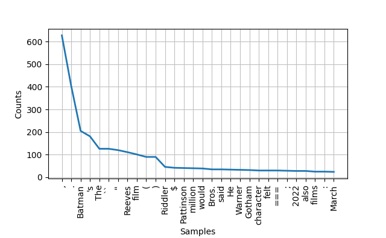

# text-mining

## Part 3: Project Writeup and Reflection

### Project Overview
In this project, wikipedia and imdb data sources was used. The main tool used in this project is Natural Language Toolkit. Through this project, I want to learn how to use NLTK to process text for sentiment analysis and word distribution to access which movie receive better review.

### Implementation
I chose to get movie data from wikipedia and imdb review to gauge the sentiment appears on two different sites. For wikipedia, my hypothesis is that the sentiments for two movies would be similar because the content wikipedia is usually facts instead of opinions. Therefore, the text should contain more neutral words. To guage this I functions to process data from two websites and to run sentiment analysis were written.

In addition to sentiment analysis, I also want to return the most frequent word in both texts. NLTK also provide tools to break down paragraphs into words and return a list with words frequency distribution. I also want to graph the distribution of words using matplotlib.

### Results
Similar to my hypothesis, the sentiment test for the wikipedia content are very similar with score for neutral being around 0.8 and much less score for positive an negative, as shown below:

```
# print(sentiment_analysis(batman_content))
{'neg': 0.084, 'neu': 0.83, 'pos': 0.087, 'compound': -0.9264}
# print(sentiment_analysis(joker_content))
{'neg': 0.094, 'neu': 0.767, 'pos': 0.14, 'compound': 0.9999}
```
However, for imdb movie review, the score for postive and negative is a bit larger. Compare the analysis result, the negative score for the Batman movie is higher than the Joker movie. In addition, the positive score of the Joker movie is a bit higher. Therefore, it is reasonable to conclude that for the specific review, the Joker movie receives a more positive review than the Batman one.
```
# print(sentiment_analysis(batman_review))
{'neg': 0.115, 'neu': 0.792, 'pos': 0.093, 'compound': -0.5109}
# print(sentiment_analysis(joker_review))
{'neg': 0.06, 'neu': 0.736, 'pos': 0.204, 'compound': 0.9668}
```
For the word distribution, I chose to exclude stop words. Comparing the results from two movies' wikipedia content, the most common words excluding punctuation is characters' name as shown in the graph below/




### Reflection
The use of those toolkits are in general easy and very straight-forward. However, I found one issue with pip install. After installation, the library is not shown when I import them. I need to restart the computer to make it work. I have done some research online but I still cannot figure out why. If I can start the project again, I would like to know how to solve this issue. I would also want to have a better knowledge of the matplotlib to generate more graphs from this project. Although I think my project makes sense, I would like to run more analysis with it if I have more time. For example, I would design the project to run multiple reveiw on imdb to get a average result for the sentiment analysis. Overall, the assignment is a useful exercise to apply text analysis in python for me. 